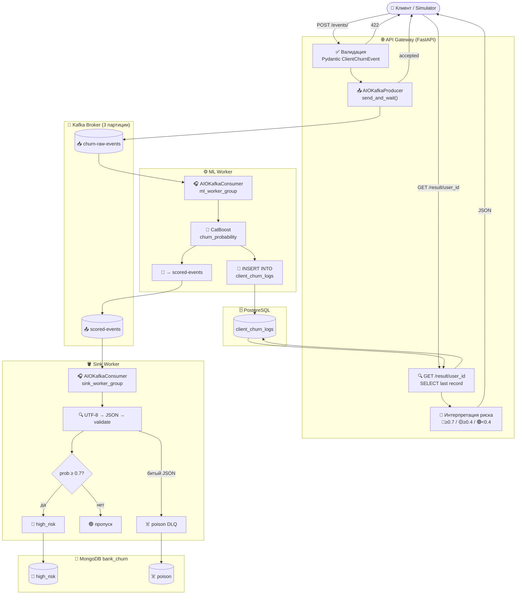

# 🏗️ Архитектура проекта Bank Churn EDA System

## 📁 Структура проекта

```
bank-churn-eda-system/
├── 📄 README.md                    # Основная документация проекта
├── 📄 requirements.txt             # Python зависимости
├── 📄 docker-compose.yml           # Конфигурация Docker контейнеров
├── 📄 .env                         # Переменные окружения
├── 📄 .gitignore                   # Исключения для Git
├── 📄 ARCHITECTURE.md              # Данный файл — описание архитектуры
│
├── 📁 src/                         # Исходный код всех микросервисов
│   ├── 📁 shared/                  # 🔗 Общие компоненты для всех сервисов
│   │   ├── __init__.py
│   │   ├── config.py               # ⚙️ Pydantic Settings — читает .env
│   │   ├── database.py             # 🗄️ Async SQLAlchemy + get_session()
│   │   ├── kafka_admin.py          # 📨 Создание топиков Kafka при старте
│   │   ├── models.py               # 📊 ORM-модель ClientChurnLog (PostgreSQL)
│   │   └── schemas.py              # 📋 Pydantic-схема ClientChurnEvent
│   │
│   ├── 📁 api_gateway/             # 🌐 Точка входа — HTTP API
│   │   ├── main.py                 # FastAPI: /events/, /result/{user_id}, /
│   │   └── kafka_producer.py       # Синглтон AIOKafkaProducer
│   │
│   ├── 📁 ml_worker/               # 🧠 Предсказание оттока
│   │   ├── consumer.py             # Consumer: raw → CatBoost → PG + scored
│   │   └── predictor.py            # Загрузка CatBoost, возвращает probability
│   │
│   ├── 📁 simulator/               # 🤖 Генератор тестовых данных
│   │   └── main.py                 # Генерирует N клиентов → POST /events/
│   │
│   ├── 📁 sink_worker/             # 🪣 Фильтрация и запись в MongoDB
│   │   ├── consumer.py             # Consumer: scored → high_risk / poison DLQ
│   │   └── mongo_client.py         # Синглтон MongoDB (high_risk, poison)
│   │
│   └── 📁 streamlit_app/           # 📊 Дашборд (в разработке)
│
├── 📁 notebooks/                   # 📓 Jupyter notebooks — EDA и эксперименты
└── 📁 plans/                       # 📋 Планы и документация разработки
```

---

## 🔧 Описание компонентов

### 🔗 `src/shared/` — Общие компоненты

**Назначение:** переиспользуемые модули, которые импортируют все остальные сервисы.
Никакой бизнес-логики — только инфраструктурный код и контракты.

| Файл | Описание |
|------|----------|
| `config.py` | `Settings` на базе Pydantic `BaseSettings`. Читает `.env`. Единственный источник конфигурации для всего проекта: Kafka, PostgreSQL, MongoDB, путь к модели. |
| `database.py` | Async SQLAlchemy engine + `AsyncSession`. Функция `get_session()` — DI-зависимость для FastAPI и ML Worker. |
| `kafka_admin.py` | Создаёт топики `churn-raw-events` и `scored-events` (по 3 партиции) при старте каждого сервиса. Retry-логика с экспоненциальным backoff до 10 попыток. |
| `models.py` | ORM-модель `ClientChurnLog` — таблица `client_churn_logs` в PostgreSQL (`user_id`, `churn_probability`, `timestamp`). |
| `schemas.py` | Pydantic-схема `ClientChurnEvent` — валидация входящих данных на `POST /events/`. |
| `__init__.py` | Делает `shared` Python-пакетом. |

---

### 🌐 `src/api_gateway/` — HTTP точка входа

**Назначение:** принять HTTP-запрос, провалидировать данные, отправить в Kafka.
Не выполняет ML-вычислений. Результаты читает из PostgreSQL.

| Файл | Описание |
|------|----------|
| `main.py` | FastAPI приложение. Три эндпоинта: `GET /` (healthcheck), `POST /events/` (валидация + отправка в Kafka), `GET /result/{user_id}` (последний результат из PostgreSQL + интерпретация риска 🔴🟡🟢). Управляет жизненным циклом продюсера через `lifespan`. |
| `kafka_producer.py` | Синглтон `AIOKafkaProducer`. Функции `start_producer()` / `stop_producer()` / `get_producer()` (DI-зависимость). Один продюсер на весь процесс. |

---

### 🧠 `src/ml_worker/` — Предсказание оттока

**Назначение:** читать сырые события из Kafka, считать вероятность оттока
через CatBoost, сохранять в PostgreSQL, публиковать результат дальше.

| Файл | Описание |
|------|----------|
| `consumer.py` | `AIOKafkaConsumer` группы `ml_worker_group`. Читает из `churn-raw-events`, передаёт данные в `predictor.py`, записывает результат в PostgreSQL (`client_churn_logs`), публикует в `scored-events`. |
| `predictor.py` | Загружает модель CatBoost (`churn_model.cbm`). Принимает словарь с данными клиента, возвращает `churn_probability` (float 0..1). Модель кэшируется в памяти. |

---

### 🪣 `src/sink_worker/` — Фильтрация и сохранение в MongoDB

**Назначение:** читать scored-события, фильтровать по уровню риска,
складывать high-risk клиентов в MongoDB. Битые сообщения — в DLQ.

| Файл | Описание |
|------|----------|
| `consumer.py` | `AIOKafkaConsumer` группы `sink_worker_group`. Читает из `scored-events`. Трёхуровневая валидация: UTF-8 decode → JSON parse → проверка обязательных полей. `prob ≥ 0.7` → коллекция `high_risk`. Невалидные сообщения → коллекция `poison` (DLQ). |
| `mongo_client.py` | Синглтон MongoDB-клиента. Методы `connect()` / `close()`. Предоставляет доступ к коллекциям `high_risk` и `poison` базы `bank_churn`. |

---

### 🤖 `src/simulator/` — Генератор тестовых данных

**Назначение:** наполнять систему реалистичными тестовыми данными без внешнего источника.

| Файл | Описание |
|------|----------|
| `main.py` | Генерирует N случайных клиентов банка (кредитный скор, возраст, баланс, география и т.д.) и отправляет через `httpx` на `POST /events/` с паузой 0.5s между запросами. |

---

### 📊 `src/streamlit_app/` — Дашборд *(в разработке)*

**Назначение:** визуализация аналитики и мониторинг системы в реальном времени.

Планируется:
- Таблица всех предсказаний из PostgreSQL (`client_churn_logs`)
- Список high-risk клиентов из MongoDB (`high_risk`)
- Распределение `churn_probability` по географии, полу, возрасту
- Метрики системы (количество событий, средний скор)

---

## 🔄 Поток данных



---

## 🔗 Зависимости между модулями

```
simulator
    └──► api_gateway              (HTTP POST /events/)

api_gateway
    ├──► shared.schemas           (валидация входящих данных)
    ├──► shared.database          (чтение из PostgreSQL)
    ├──► shared.models            (ORM ClientChurnLog)
    └──► kafka_producer           (отправка в Kafka)

ml_worker
    ├──► shared.config
    ├──► shared.database
    ├──► shared.models
    ├──► shared.kafka_admin
    └──► predictor                (CatBoost inference)

sink_worker
    ├──► shared.config
    ├──► shared.kafka_admin
    └──► mongo_client             (MongoDB high_risk + poison DLQ)

streamlit_app  [в разработке]
    ├──► shared.database          (PostgreSQL аналитика)
    └──► mongo_client             (MongoDB high-risk)
```

---

## 📨 Kafka топики

| Топик | Партиции | Продюсер | Консьюмер | Содержимое |
|-------|----------|----------|-----------|------------|
| `churn-raw-events` | 3 | `api_gateway` | `ml_worker` | Сырые данные клиента банка |
| `scored-events` | 3 | `ml_worker` | `sink_worker` | `user_id` + `churn_probability` + `timestamp` |

---

## 🗄️ Хранилища данных

### PostgreSQL — `client_churn_logs`

| Поле | Тип | Описание |
|------|-----|----------|
| `user_id` | `VARCHAR` | Идентификатор клиента |
| `churn_probability` | `FLOAT` | Вероятность оттока (0..1) |
| `timestamp` | `TIMESTAMP` | Время предсказания |

### MongoDB — база `bank_churn`

| Коллекция | Кто пишет | Содержимое |
|-----------|-----------|------------|
| `high_risk` | `sink_worker` | Клиенты с `prob ≥ 0.7` |
| `poison` | `sink_worker` | Невалидные сообщения (DLQ) |

---

## 📊 Этапы реализации

| Этап | Статус | Описание |
|------|--------|----------|
| **Этап 1** | ✅ Готово | API Gateway + Kafka Producer |
| **Этап 2** | ✅ Готово | ML Worker + CatBoost + PostgreSQL |
| **Этап 3** | ✅ Готово | Sink Worker + MongoDB + DLQ |
| **Этап 4** | ✅ Готово | Simulator — генератор тестовых данных |
| **Этап 5** | ⏳ В работе | Streamlit Dashboard |
| **Этап 6** | 🔜 Планируется | Redis кэширование модели |
| **Этап 7** | 🔜 Планируется | Prometheus + Grafana метрики |
| **Этап 8** | 🔜 Планируется | Production Kafka (replication factor = 3) |
