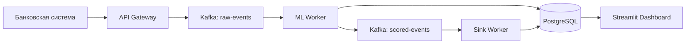

# 🏗️ Архитектура проекта Bank Churn EDA System

## 📁 Структура проекта

```
bank-churn-eda-system/
├── 📄 README.md                    # Основная документация проекта
├── 📄 requirements.txt             # Python зависимости
├── 📄 docker-compose.yml           # Конфигурация Docker контейнеров
├── 📄 .env                         # Переменные окружения
├── 📄 .gitignore                   # Исключения для Git
├── 📄 ARCHITECTURE.md              # Данный файл - описание архитектуры
│
├── 📁 src/                         # Исходный код всех микросервисов
│   ├── 📁 shared/                  # 🔗 Общие компоненты для всех сервисов
│   │   ├── __init__.py
│   │   ├── config.py               # ⚙️ Настройки приложения (Kafka, DB, Redis)
│   │   ├── database.py             # 🗄️ Подключение к PostgreSQL
│   │   ├── models.py               # 📊 SQLAlchemy модели для БД
│   │   └── schemas.py              # 📋 Pydantic схемы для валидации данных
│   │
│   ├── 📁 api_gateway/             # 🌐 API Gateway - точка входа в систему
│   │   ├── main.py                 # FastAPI приложение с эндпоинтами
│   │   └── kafka_producer.py       # Отправка событий в Kafka
│   │
│   ├── 📁 ml_worker/               # 🧠 ML Worker - обработка и предсказание
│   │   ├── consumer.py             # Чтение из Kafka + ML инференс
│   │   └── predictor.py            # ML модель для предсказания оттока
│   │
│   ├── 📁 simulator/               # ⚙️ Симулятор банковских данных (планируется)
│   ├── 📁 sink_worker/             # 📥 Воркер записи результатов в БД (планируется)
│   └── 📁 streamlit_app/           # 📊 Dashboard для мониторинга (планируется)
│
├── 📁 notebooks/                   # 📓 Jupyter notebooks для EDA и экспериментов
└── 📁 plans/                       # 📋 Планы и документация разработки
    └── file_migration_plan.md      # План миграции файлов
```

## 🔧 Описание компонентов

### 🔗 src/shared/ - Общие компоненты
**Назначение:** Переиспользуемые модули для всех микросервисов

- **[`config.py`](src/shared/config.py)** - Централизованные настройки:
  - Подключение к Kafka (bootstrap servers, топики)
  - Строки подключения к БД (PostgreSQL, MongoDB, Redis)
  - Конфигурация проекта

- **[`database.py`](src/shared/database.py)** - Подключение к PostgreSQL:
  - Асинхронный движок SQLAlchemy
  - Фабрика сессий для работы с БД
  - Базовый класс для моделей

- **[`models.py`](src/shared/models.py)** - SQLAlchemy модели:
  - `ClientChurnLog` - таблица для хранения результатов скоринга
  - Модели для метаданных ML моделей
  - Аудит логи

- **[`schemas.py`](src/shared/schemas.py)** - Pydantic схемы:
  - `ClientChurnEvent` - входящие данные клиента
  - `ScoredEvent` - результат ML предсказания
  - Схемы валидации для API

### 🌐 src/api_gateway/ - API Gateway
**Назначение:** Точка входа в систему, прием HTTP запросов

- **[`main.py`](src/api_gateway/main.py)** - FastAPI приложение:
  - Эндпоинт `/events/` для приема данных клиентов
  - Валидация входящих данных через Pydantic
  - Отправка событий в Kafka для асинхронной обработки
  - Health check эндпоинт

- **[`kafka_producer.py`](src/api_gateway/kafka_producer.py)** - Kafka продюсер:
  - Асинхронная отправка сообщений в топик `raw-events`
  - Управление жизненным циклом продюсера
  - Обработка ошибок отправки

### 🧠 src/ml_worker/ - ML Worker
**Назначение:** Обработка событий и ML предсказание оттока

- **[`consumer.py`](src/ml_worker/consumer.py)** - Kafka консьюмер:
  - Чтение событий из топика `raw-events`
  - Вызов ML модели для предсказания
  - Сохранение результатов в PostgreSQL
  - Отправка результатов в топик `scored-events`

- **[`predictor.py`](src/ml_worker/predictor.py)** - ML модель:
  - Загрузка обученной модели (CatBoost/XGBoost)
  - Предобработка данных клиента
  - Расчет вероятности оттока
  - Кэширование модели в памяти

### 📁 Планируемые компоненты

- **src/simulator/** - Генератор тестовых данных клиентов
- **src/sink_worker/** - Воркер для записи scored-events в БД
- **src/streamlit_app/** - Web dashboard для мониторинга системы

## 🔄 Поток данных



## 🚀 Запуск системы

1. **Инфраструктура:** `docker-compose up -d` (Kafka, PostgreSQL, MongoDB, Redis)
2. **API Gateway:** `python -m src.api_gateway.main`
3. **ML Worker:** `python -m src.ml_worker.consumer`

## 📊 Этапы реализации

- ✅ **Этап 1-2:** API Gateway + ML Worker (Завершено)
- 🔜 **Этап 3:** Интеграция реальной ML модели
- ⏳ **Этап 4:** Dead Letter Queue + MongoDB аудит
- ⏳ **Этап 5:** Redis кэширование
- ⏳ **Этап 6:** Мониторинг и метрики
