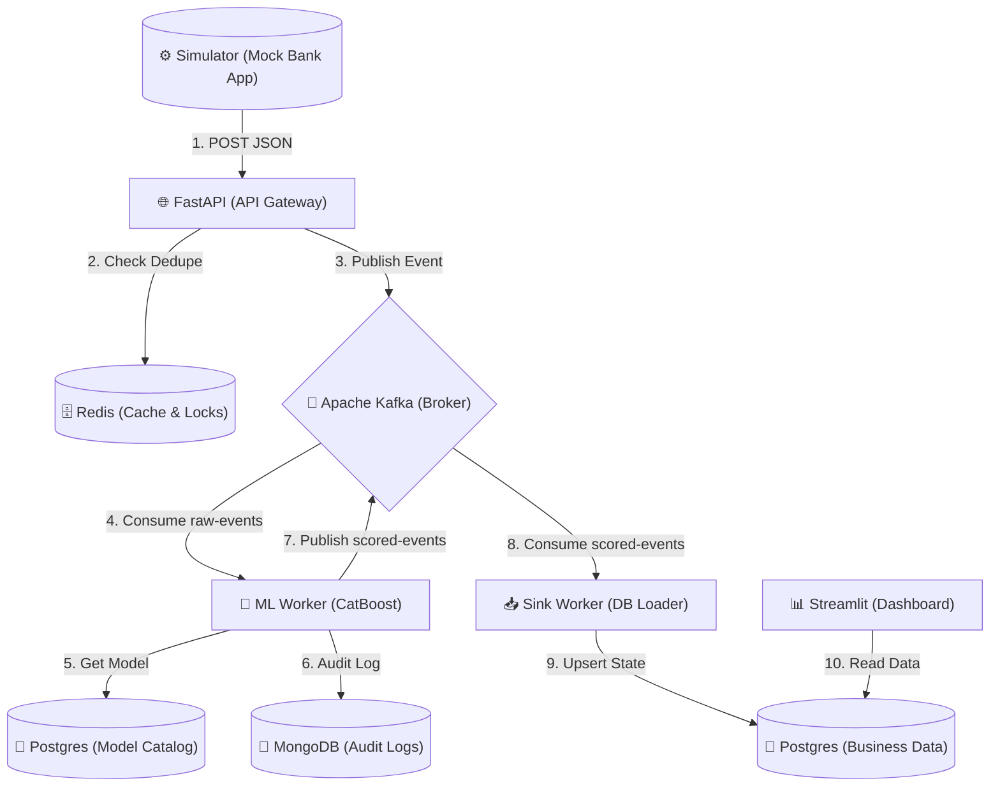
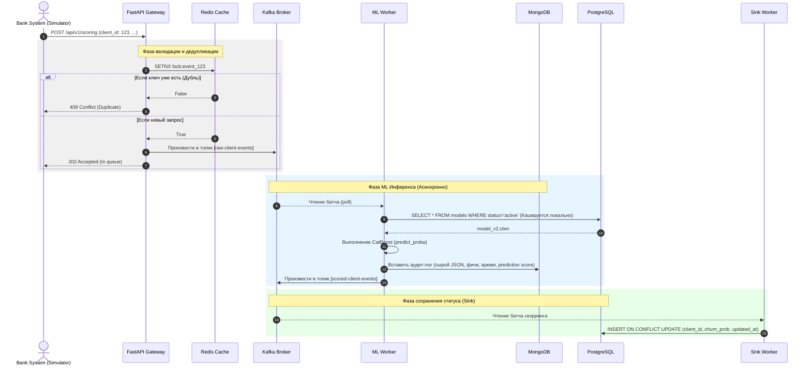
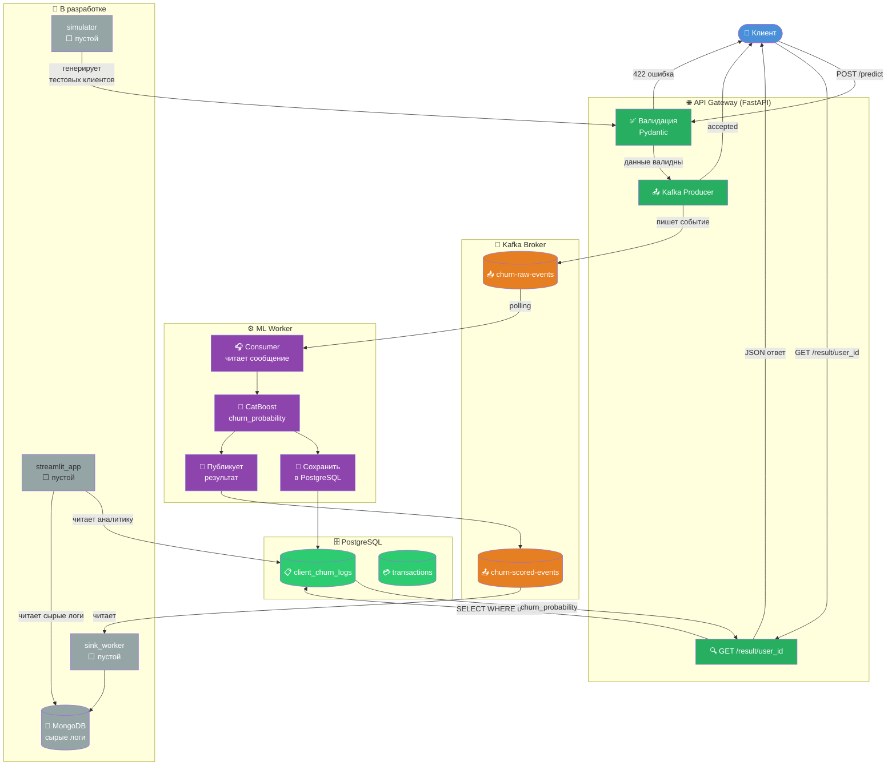

# 🏦 Bank Customer Churn EDA System (HighLoad ML Architecture)

## 📌 Описание проекта
HighLoad-система для предсказания оттока клиентов банка (Churn Rate) в режиме Near-Real-Time. 
Проект реализует микросервисную **Event-Driven Architecture (EDA)** для обработки непрерывного потока транзакционных и поведенческих данных клиентов. 
Система защищена от дублирования сообщений (Idempotency) с помощью Redis и реализует паттерн DLQ (Dead Letter Queue) для обработки невалидных данных (Poison Pills).

**ML задача:** Бинарная классификация оттока на основе [Kaggle Bank Customer Churn Dataset].

## 🏗 Архитектура системы

Ниже представлена C4 (Component) диаграмма развертывания проекта:

## 🏗 Диаграмма процесса 

Это технический аналог BPMN, который пошагово описывает жизнь одного конкретного запроса во времени. Именно по этой схеме мы будем писать логику.

## 🏗  Инфра

